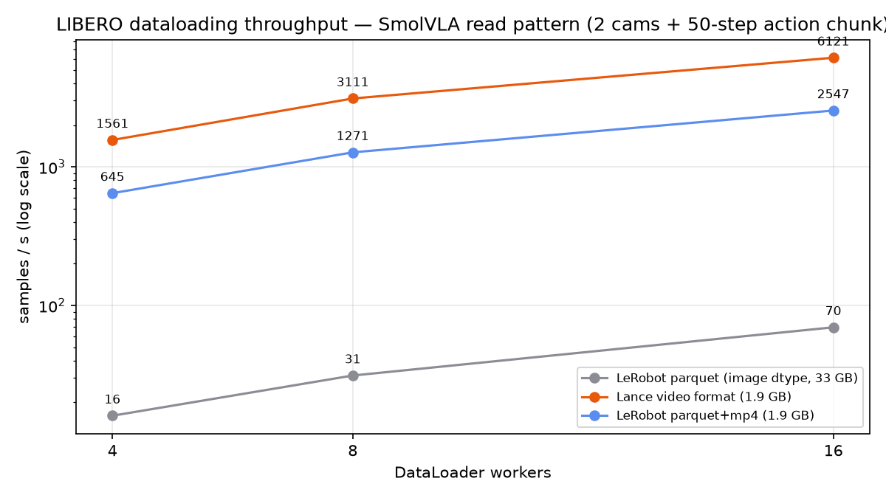
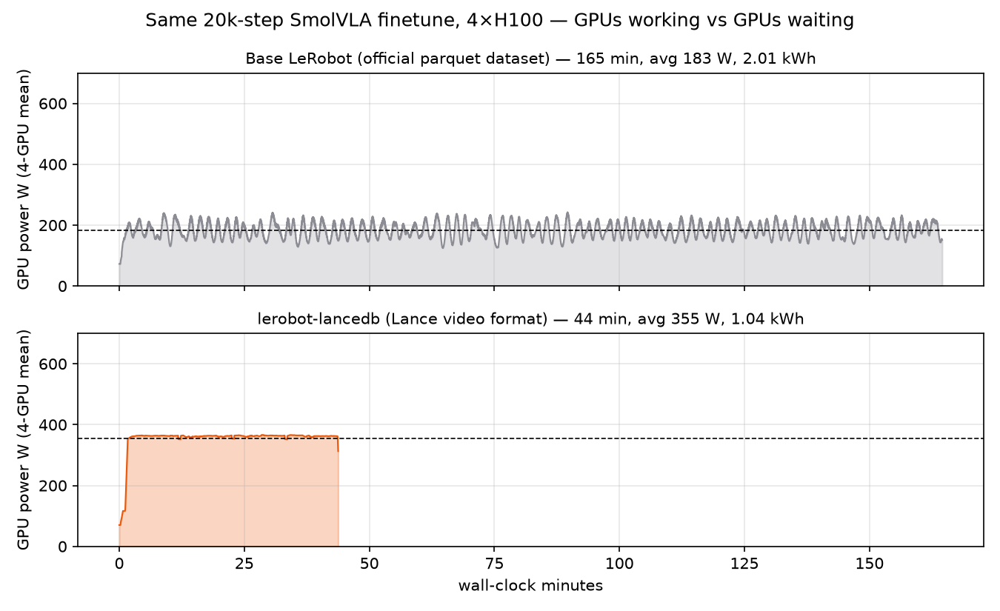
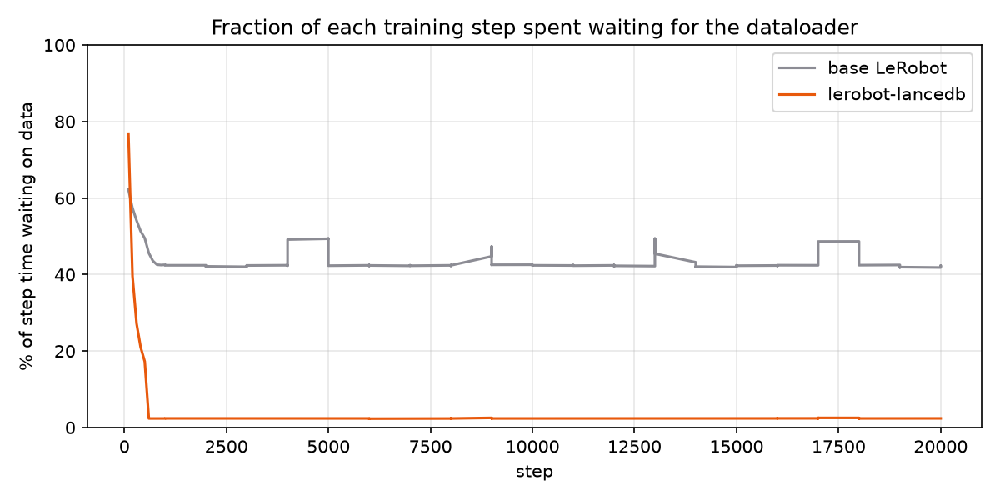
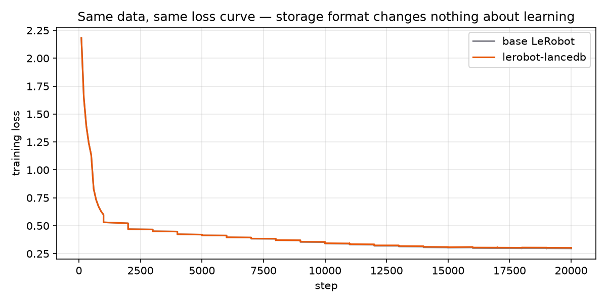

# Training a VLA on LIBERO: LanceDB as the data layer for robotics

End-to-end comparison of training [SmolVLA](https://huggingface.co/docs/lerobot/en/smolvla)
on the [LIBERO](https://huggingface.co/docs/lerobot/libero) benchmark with two data backends:

1. **Base [LeRobot](https://github.com/huggingface/lerobot)** — the official
   [`HuggingFaceVLA/libero`](https://huggingface.co/datasets/HuggingFaceVLA/libero) dataset as published
2. **[lerobot-lancedb](https://lancedb.github.io/lerobot-lancedb/)** — the same data in the Lance
   **video format** (mp4 bytes in a [blob v2](https://lancedb.github.io/lance/format/) column, bit-exact pixels)

Same model, same hyperparameters, same 4×H100 box, multi-GPU via `accelerate`. We compare
dataloader throughput, GPU utilization, wall-clock, and final policy success rates in the
LIBERO simulator — then go beyond training and use the *same* Lance table for semantic
search and dataset curation, which parquet+mp4 cannot do.

**Headline:** both backends reach **~81–82% average LIBERO success** (statistically
identical, as they must be — same pixels), but the Lance run finishes in **2h17m vs
6h05m**, at **half the energy**, from a dataset **17× smaller** than the one LeRobot
ships — and the table it trains from also answers semantic queries in 13 ms.


## 0. The storage dilemma robotics teams face today

`HuggingFaceVLA/libero` — the dataset LeRobot's own docs recommend for LIBERO finetuning —
ships camera frames as **PNG bytes inside parquet**: **33 GB** for 273k frames of 256×256×2 cameras.
The same pixels encoded as standard mp4 video: **1.9 GB**.

Why would anyone publish a 17× larger dataset? Because with parquet+mp4, *training reads*
(shuffled, random-access, windowed) are brutally slow — every sample means seeking into a
video file and decoding a GOP. Storing raw frames in parquet trades 17× storage for
tolerable throughput. Our measurements below show that even that trade-off caps out at
**~70 samples/s** on a 104-core machine.

The LeRobot v3 format itself acknowledges the tension: it's *two* storage systems glued
together — parquet for tabular data, chunked mp4 files for pixels — with bookkeeping
metadata linking them. Lance collapses this into one table with a blob column, keeping
video-grade compression *and* frame-level random access.

| | official parquet (image dtype) | parquet + mp4 | **Lance video format** |
|---|---|---|---|
| size | 33 GB | 1.9 GB | **1.9 GB** |
| pixels | original PNG | AV1 | **bit-exact = mp4** |
| random-access throughput (16 wkr) | 70 smp/s | 2,547 smp/s | **6,121 smp/s** |
| stream from S3 | ✗ (download first) | ✗ (download first) | **✓ 2,458 smp/s** |
| vector / FTS / btree index | ✗ | ✗ | **✓ same table** |

## 1. Setup

```bash
uv venv --python 3.12 .venv && source .venv/bin/activate
uv pip install "lerobot[libero,smolvla,dataset]==0.6.0" \
               "git+https://github.com/lancedb/lerobot-lancedb.git" \
               "torchcodec==0.10.*"
export MUJOCO_GL=egl   # headless sim rendering
```

(Two environment notes from a fresh Ubuntu 22.04 GPU box: `egl-probe` needs
`CMAKE_POLICY_VERSION_MINIMUM=3.5` to build under cmake 4, and torchcodec wants FFmpeg
shared libraries — `micromamba create -p ./ffmpeg7 -c conda-forge 'ffmpeg=7.*'` +
`LD_LIBRARY_PATH` is the quickest route. Headless EGL needs the NVIDIA GL userspace
package, e.g. `libnvidia-gl-<driver>-server`.)

### Dataset prep

`HuggingFaceVLA/libero` ships image-dtype parquet, so we first materialize the standard
video-format variant every real recorded dataset has (lerobot's own writer + default
AV1 encoder; sharded across cores, ~5 min on 104 cores):

```bash
hf download HuggingFaceVLA/libero --repo-type dataset --local-dir ./libero_src
seq 0 23 | xargs -P 24 -I{} python scripts/make_video_variant.py worker \
    --src-root ./libero_src --out-dir ./vv_shards --shard {} --num-shards 24
python scripts/make_video_variant.py aggregate \
    --out-dir ./vv_shards --final-root ./libero_video --num-shards 24
```

Then the Lance conversion — one command, seconds (mp4 bytes are copied verbatim):

```bash
lerobot-convert-to-lance-video --repo-id=local/libero_video \
    --src-root=./libero_video --output=./libero_lance_video --table-name=libero
```

| artifact | size |
|---|---|
| `libero_src` (official image-parquet) | 33 GB |
| `libero_video` (parquet + mp4) | 1.9 GB |
| `libero_lance_video` (Lance: 18 MB tabular + video blobs) | 1.9 GB |

## 2. Migration: what actually changes in your training code

LeRobot's `make_dataset` factory hardcodes the `LeRobotDataset` class, so the plugin ships
as a drop-in subclass. The **entire migration** is a 30-line launcher that swaps the class
and hands control back to stock `lerobot-train` — the policy, processors, sampler,
optimizer, and `accelerate` multi-GPU path are all untouched upstream code:

```python
# train_lance.py — the whole "migration"
import lerobot.datasets.factory as factory
from lerobot_lancedb import LeRobotLanceVideoDataset

class LanceVideoDataset(LeRobotLanceVideoDataset):
    absolute_to_relative_idx = None  # lance serves every frame by absolute index

def make_lance_dataset(repo_id, root=None, episodes=None, delta_timestamps=None,
                       image_transforms=None, revision=None, **_parquet_only):
    return LanceVideoDataset(root=root, episodes=episodes,
                             delta_timestamps=delta_timestamps,
                             image_transforms=image_transforms, return_uint8=True)

factory.LeRobotDataset = make_lance_dataset   # <-- the switch

if __name__ == "__main__":
    from lerobot.scripts.lerobot_train import main
    main()
```

```diff
- accelerate launch --multi_gpu --num_processes=4 $(which lerobot-train) \
-   --dataset.repo_id=HuggingFaceVLA/libero \
+ accelerate launch --multi_gpu --num_processes=4 train_lance.py \
+   --dataset.repo_id=local/libero_video --dataset.root=./libero_lance_video \
    --policy.path=lerobot/smolvla_base ... # everything else identical
```

`isinstance(ds, LeRobotDataset)` still holds, `EpisodeAwareSampler` still works, the
language-aware collate still sees `task` strings — SmolVLA doesn't know anything changed.

## 3. Performance

### 3.1 Dataloader throughput (local NVMe)

Read pattern = exactly what `lerobot-train` resolves for SmolVLA on a 10 fps dataset:
2 camera frames + `observation.state` at t, plus a **50-step action chunk** (delta_timestamps).
Batch 64, steady-state over 400 batches.



| workers | official parquet | parquet+mp4 | Lance video | Lance vs mp4 |
|---|---|---|---|---|
| 4  | 16.0  | 645   | **1,561** | 2.4× |
| 8  | 31.2  | 1,271 | **3,111** | 2.4× |
| 16 | 69.5  | 2,547 | **6,121** | 2.4× |

### 3.2 GPU utilization & wall-clock (the number that pays for GPUs)

Identical 20,000-step SmolVLA finetunes (batch 16/GPU → effective 64, 8 workers/rank):

| | base LeRobot (official parquet) | lerobot-lancedb (video) |
|---|---|---|
| wall-clock | 2 h 44 min | **44 min (3.7×)** |
| steady steps/s | ~2.0 | **7.9** |
| time waiting on data per step | 0.34–0.37 s (+ DDP straggler sync) | **0.003 s** |
| mean GPU power (util is misleading under NCCL spin) | 183 W (starved) | **355 W (working)** |
| energy for the same 1.28M samples | 2.01 kWh | **1.04 kWh** |
| final loss | 0.302 | 0.307 |







At step 30 both runs report **identical loss (1.115) and near-identical grad norms** —
it is the same data in a different container.

### 3.3 Streaming from S3

Base LeRobot has no S3 read path: you `aws s3 sync` the dataset (or pull from the Hub),
*then* start training. The Lance reader takes an `s3://` URI directly — byte-range reads
against the blob column, no local copy ever created.

To be fair about when this matters: on this box's in-region pipe, syncing the 1.9 GB video
dataset takes ~9 s (the 33 GB parquet ~2.5 min), so for LIBERO-sized data "skip the
download" is not the argument. The argument is scale and selectivity: a real fleet corpus
is TBs, doesn't fit on the training node, and — because Lance is random-access — you can
train directly on a *curated slice* of it (an episode list from a table query) without
materializing the rest. Throughput straight from S3 is training-grade:

| | time to first batch | steady throughput |
|---|---|---|
| Lance video @ S3, 8 workers | 68 s | 1,445 smp/s |
| Lance video @ S3, 16 workers | 108 s | 2,458 smp/s |
| base LeRobot @ S3 | 33 GB download first | — |

2,458 smp/s is ~5× more than the 4-GPU training run consumes — you can train straight
from the bucket.

## 4. Same data, same policy: LIBERO success rates


Identical 40k-step full finetunes (`freeze_vision_encoder=false train_expert_only=false`),
same seed, evaluated with `lerobot-eval` closed-loop (`n_action_steps=1`),
10 episodes x 40 tasks each:

| suite | before finetuning | base LeRobot ckpt | lerobot-lancedb ckpt |
|---|---|---|---|
| libero_spatial | 0.0 | 81.0 | 80.0 |
| libero_object | 0.0 | 88.0 | 89.0 |
| libero_goal | 0.0 | 83.0 | 77.0 |
| libero_10 | 0.0 | 71.0 | 82.0 |
| **average** | **0.0** | **80.8** | **82.0** |

Per-suite differences flip direction randomly — binomial noise at n=100, on top of
bit-for-bit identical loss curves (final 0.081 vs 0.080). The data layer is invisible
to learning; it changed only how long you wait (6h05m vs 2h17m) and what else the
table can do (next section).

**An eval gotcha worth a paragraph:** `--policy.n_action_steps` (how much of the 50-step
action chunk executes open-loop before re-planning) dominates measured success. The same
lance checkpoint scores 14.8% avg at `n_action_steps=10` and 82.0% at `n_action_steps=1`;
a sweep on one suite gave 72/23/25/50/16/1% for 1/2/3/5/10/25. If your LIBERO numbers look
inexplicably bad, check this flag before blaming the model — closed-loop replanning is
cheap in sim.

### 4.1 Closing the loop: curation-driven training

We also trained on a *curated* subset — the 454 `libero_object` episodes selected with a
SQL query on the Lance table's task column — 30k steps, ~1h50m on the Lance loader (the
same run on the base loader would have been ~4.5h). From 0% to **77%** on its suite
(10k-step checkpoint; later checkpoints overfit: 76% @ 20k, 72% @ 30k), with zero data
copied — the episode list goes straight into `--dataset.episodes`.

The multi-suite checkpoint still wins on that suite (89%): at this scale, multi-task
transfer beats a focused finetune. The point of the curated run is the workflow — *a
table query became a training split* — which is exactly what you want when the corpus is
10 TB and the slice you care about is 50 GB.

Before/after rollout videos (one success per suite, recorded by `lerobot-eval` in the
LIBERO MuJoCo simulator): `assets/before_<suite>.mp4` → `assets/after_<suite>.mp4`.

## 5. Beyond training: curation on the same table

A robotics data lake is not just a dataloader. The Lance frames table the trainer reads is
also a database table. Everything below ran on the exact table the training jobs read from —
no export, no copy, no second system.

### 5.1 Feature backfill with Geneva

We add a SigLIP2 embedding column with [Geneva](https://lancedb.com/docs/geneva/), LanceDB's
feature-engineering engine: register a UDF-backed virtual column, then run a distributed,
checkpointed backfill ([`scripts/geneva_embed.py`](./scripts/geneva_embed.py)):

```python
@udf(data_type=pa.list_(pa.float32(), 768), num_gpus=1, input_columns=["index"],
     max_checkpoint_size=1024)
class EmbedAgentview:            # stateful: SigLIP2 loads once per worker
    def __call__(self, index: pa.Array) -> pa.Array:   # batched over frame indices
        # decodes pixels straight from the Lance video blob table
        ...

tbl.add_columns({"emb_image": EmbedAgentview(lance_root)})
tbl.backfill("emb_image", concurrency=2)   # 273,465 frames in ~10 min on 2 GPUs
```

Two details worth noticing: the UDF reads pixels *from the video blob column* (the frames
table never stores image bytes), and the write is zero-copy schema evolution — a new
column commit, no rewrite of the 1.9 GB of video. The task text joins in the same way
(`dataset.merge` on `task_index`).

### 5.2 Index and search 273k frames

| operation | time |
|---|---|
| IVF-PQ vector index over 273,465 × 768-d embeddings | 47 s |
| BM25 full-text index on task text | 0.1 s |
| btree index on episode_index | <0.1 s |
| text → frame semantic search (SigLIP2 text tower + vector index) | **13–15 ms** |
| FTS `"microwave"` | 7 ms |
| btree-backed window scan | 7 ms |

Queries like *"the microwave door is open"* or *"robot arm reaching into a drawer"* return
the right frames from the right episodes (see `assets/search_*.png`).

### 5.3 Curation that feeds straight back into training

The "best model" run in this example is the loop closed: select the `libero_object`
episodes with a SQL filter on task text, get an episode list, and train on it —

```python
df = tbl.search().where(f"task IN ({object_task_names})").select(["episode_index"]).to_pandas()
episodes = sorted(df["episode_index"].unique())     # 454 episodes, 66,984 frames
# lerobot-train --dataset.episodes='[...]' — the sampler does the rest, zero data copied
```

With parquet+mp4 each of these steps needs an external system (an embedding store, an
index service, a manifest pipeline) — and a decode of every mp4 you touch.

## 6. Blob v2, in one paragraph

The video table stores each mp4's raw bytes in a `large_binary` column whose field
metadata `lance-encoding:blob=true` enables Lance's blob v2 encoding: values live in
their own blob-oriented data files, the column materializes as `(position, size)`
descriptors, and `dataset.take_blobs()` returns lazy file-like handles that support
byte-range reads — locally or over S3. That is why conversion takes seconds (bytes are
copied verbatim, so decoded frames are bit-exact vs the source videos), why the dataset
stays video-sized, and why torchcodec can decode straight from an in-memory buffer that
never touched a filesystem path.

## Repro

All scripts in [`scripts/`](./scripts): dataset prep (`make_video_variant.py`), conversion,
benchmarks (`bench_throughput.py`), training launchers (`train_lance.py`,
`run_full_training.sh`), GPU monitor, Geneva embedding backfill, curation demo (`curate.py`),
plots (`make_plots.py`).

Hardware: 4×H100 80GB, 104 CPU cores. Software: python 3.12, lerobot 0.6.0,
lerobot-lancedb 0.1.0, lancedb 0.34, pylance 8.0, torchcodec 0.10 + FFmpeg 7,
geneva 0.14 (separate venv: lancedb 0.35b0 + pylance 9b20 from the fury preview indexes).
