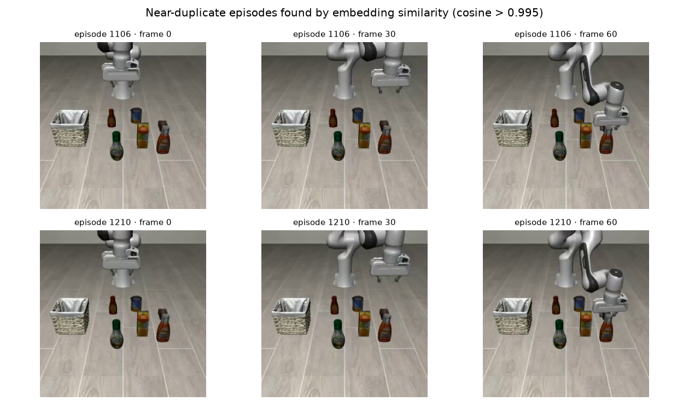
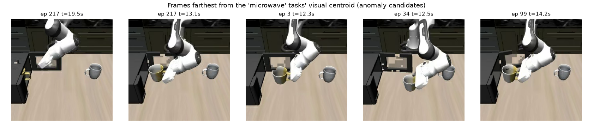

# Training a VLA on LIBERO: LanceDB as the data layer for robotics

End-to-end comparison of training [SmolVLA](https://huggingface.co/docs/lerobot/en/smolvla)
on the [LIBERO](https://huggingface.co/docs/lerobot/libero) benchmark with two data backends:

1. **Base [LeRobot](https://github.com/huggingface/lerobot)** — the standard v3 parquet+mp4 layout
2. **[lerobot-lancedb](https://lancedb.github.io/lerobot-lancedb/)** — the same mp4 bytes in the Lance
   **video format** (a [blob v2](https://lancedb.github.io/lance/format/) column, bit-exact pixels, same size on disk)

Same model, same hyperparameters, same 4×H100 box, multi-GPU via `accelerate`. We compare
dataloader throughput, GPU utilization, wall-clock, and final policy success rates in the
LIBERO simulator — then go beyond training and use the *same* Lance table for semantic
search and dataset curation, which parquet+mp4 cannot do.

**Headline:** identical ACT trainings on DROID finish **2.31× faster end-to-end** with
the Lance video format at a 4-vCPU/GPU cloud budget (1.83× at 8 vCPU/GPU) — same mp4
bytes, bit-identical loss, statistically tied sim success. A 450M VLA (SmolVLA on LIBERO)
reaches **~81–82% success from both backends**, and the table it trains from also answers
semantic queries in 13 ms.

## 0. Robot data wants to be video — training reads don't

The LeRobot v3 format stores a dataset as two systems glued together: parquet for the
tabular columns, chunked mp4 files for pixels, and bookkeeping metadata linking them.
Video is the right container for robot camera streams — but a shuffled training read
(a random frame per camera plus a 50-step action window) pays a seek-and-decode cost
into those mp4s on every sample, and nothing about parquet+mp4 can answer a query like
*"find frames where the gripper is above the stove."*

`lerobot-lancedb` keeps the mp4 bytes **verbatim** in a Lance blob v2 column: the dataset
stays video-sized, decoded pixels are bit-exact vs the source videos, and the Lance format
supplies what the glue can't — fast frame-level random access, S3 byte-range streaming,
and vector/full-text/scalar indexes on the same table the trainer reads.

| | LeRobot parquet + mp4 | **Lance video format** |
|---|---|---|
| size (LIBERO: 273k frames, 2 cams) | 1.9 GB | **1.9 GB** |
| pixels | mp4 | **bit-exact = same mp4 bytes** |
| random-access throughput (16 wkr) | 2,547 smp/s | **6,121 smp/s** |
| stream from S3 | ✗ (download first) | **✓ 2,458 smp/s** |
| vector / FTS / btree index | ✗ | **✓ same table** |

## 1. Setup

```bash
uv venv --python 3.12 .venv && source .venv/bin/activate
uv pip install "lerobot[libero,smolvla,dataset]==0.6.0" \
               "lerobot-lancedb>=0.2.1" "torchcodec==0.10.*"
export MUJOCO_GL=egl   # headless sim rendering
```

(Two environment notes from a fresh Ubuntu 22.04 GPU box: `egl-probe` needs
`CMAKE_POLICY_VERSION_MINIMUM=3.5` to build under cmake 4, and torchcodec wants FFmpeg
shared libraries — `micromamba create -p ./ffmpeg7 -c conda-forge 'ffmpeg=7.*'` +
`LD_LIBRARY_PATH` is the quickest route. Headless EGL needs the NVIDIA GL userspace
package, e.g. `libnvidia-gl-<driver>-server`.)

### Dataset prep

The published `HuggingFaceVLA/libero` stores frames with the image dtype, so we first
materialize the standard v3 video-format dataset (the layout every recorded LeRobot
dataset has) with lerobot's own writer and default encoder — sharded across cores,
~5 min on 104 cores:

```bash
hf download HuggingFaceVLA/libero --repo-type dataset --local-dir ./libero_src
seq 0 23 | xargs -P 24 -I{} python scripts/make_video_variant.py worker \
    --src-root ./libero_src --out-dir ./vv_shards --shard {} --num-shards 24
python scripts/make_video_variant.py aggregate \
    --out-dir ./vv_shards --final-root ./libero_video --num-shards 24
```

Then the Lance conversion — one command, seconds (mp4 bytes are copied verbatim):

```bash
lerobot-convert-to-lance-video --repo-id=local/libero_video \
    --src-root=./libero_video --output=./libero_lance_video --table-name=libero
```

| artifact | size |
|---|---|
| `libero_video` (parquet + mp4) | 1.9 GB |
| `libero_lance_video` (Lance: 18 MB tabular + video blobs) | 1.9 GB |

## 2. Integration

The dataset classes are drop-in `LeRobotDataset` subclasses — `isinstance` passes,
`EpisodeAwareSampler` works, the language collate sees task strings. The standard
integration is to construct the dataset wherever your code builds one:

```python
from lerobot_lancedb import LeRobotLanceVideoDataset

dataset = LeRobotLanceVideoDataset(
    "lerobot/droid_100", root="./droid100_lance",
    delta_timestamps=delta_timestamps,  # resolved from your policy config as usual
    return_uint8=True,
)
# everything downstream unchanged: sampler, DataLoader, your train loop
```

Prefer the stock `lerobot-train` CLI unchanged? lerobot's factory has no dataset-class
hook, so [`scripts/train_lance.py`](./scripts/train_lance.py) points the factory at the
Lance class — a pragmatic 7-line patch, clearly labeled as one:

```python
import lerobot.datasets.factory as factory
from lerobot_lancedb import LeRobotLanceVideoDataset

factory.LeRobotDataset = LeRobotLanceVideoDataset

if __name__ == "__main__":
    from lerobot.scripts.lerobot_train import main
    main()
```

## 3. Performance: end-to-end training speed

The speed benchmark pairs a fast policy (ACT, ~50M params) with real-robot data
([`lerobot/droid_100`](https://huggingface.co/datasets/lerobot/droid_100) — DROID as
published for LeRobot: 3 cameras, 180×320). Identical 4×H100 trainings, same seed, same
mp4 bytes, batch 64/rank, 8 workers/GPU; the CPU budget is pinned per run (both backends
identically) to emulate real machines:

| vCPU per GPU (instance class) | base smp/s | Lance smp/s | e2e speedup |
|---|---|---|---|
| 3 | 453 | 1,293 | **2.85×** |
| 4 (g4dn / g5.xlarge / Colab) | 655 | 1,684 | **2.57×** |
| 8 (p3-class) | 1,348 | 2,585 | **1.92×** |
| 26 (p5-class — this box, no cap) | 2,460 | 3,108 | **1.26×** |

Full 20k-step wall-clock confirmation runs:

| run | base | Lance | speedup |
|---|---|---|---|
| DROID @ 4 vCPU/GPU | 1h55m37s | **50m04s** | **2.31×** |
| DROID @ 8 vCPU/GPU | 60m37s | **33m06s** | **1.83×** |
| ALOHA-sim @ 4 vCPU/GPU | 1h38m42s | **53m13s** | **1.85×** |

Training loss is bit-identical at every logged step (DROID final: 0.225 vs 0.225) — same
bytes, same model, same result; one just waits on its dataloader. On ALOHA-sim the sweep
gives 2.47×/2.31×/1.29×/1.06× at 3/4/8/26 vCPU/GPU, and even **lerobot's stock defaults
on the full 104-thread box show 1.46×** (nw=4, no CPU cap anywhere).

The trained checkpoints prove quality parity in simulation (gym-aloha transfer-cube,
50 episodes each): **0% before training → 60% (base) vs 58% (Lance)** — a statistical
tie from checkpoints trained in 99 vs 53 minutes. Before/after videos:
`assets/act_before_*.mp4` → `assets/act_after_*.mp4`.

### Why faster GPUs make this gap bigger

Sample demand rises with every accelerator generation while CPU-per-GPU stays roughly
flat (DGX H100 and DGX B200 ship ~14 cores/GPU). We measured the mechanism: raising
demand at fixed CPU (bs32→bs64) moved the delta from 1.98× to 2.31×. An H200/B300 does
to demand what a bigger batch does — the budget-tier column above is a preview of where
faster GPUs take every configuration, converging on the dataloader-cost ceiling
(~2.4–2.9× on these read patterns). See [`H200_RUNBOOK.md`](./H200_RUNBOOK.md) to verify
on newer silicon.

### Loader-only vs end-to-end: the convergence

The loader measured in isolation is where the advantage lives; training exposes it only
when the loader binds. Side by side:

| read pattern | loader-only (8 wkr) | e2e @26 vCPU/GPU | e2e @8 | e2e @4 | e2e @3 |
|---|---|---|---|---|---|
| DROID (3 cams) | **2.37×** | 1.26× | 1.92× | 2.57× | **2.85×** |
| ALOHA sim (1 cam) | **2.81×** | 1.06× | 1.29× | 2.31× | **2.47×** |

Squeezed budgets push e2e to — on DROID slightly past — the loader-only ratio (a starved
mp4 loader also steals CPU from trainer threads). Heavy 4-cam 480×640 real data is the
counterexample that proves the mechanism: decode dominates both formats equally there and
the loader ratio itself collapses to 1.25×.

### Object storage as a first-class training disk

Base LeRobot has no S3 read path (sync first, then train). The Lance reader takes an
`s3://` URI directly. The headline: **streaming Lance from S3 is faster than reading
parquet+mp4 from local NVMe, on every pattern we measured** (samples/s, 8 workers,
same-region bucket, time-to-first-batch 10–15 s):

| read pattern | parquet+mp4, local NVMe | Lance, streamed from S3 | Lance, local NVMe |
|---|---|---|---|
| DROID (3 cams) | 722 | **897** | 1,709 |
| ALOHA sim | 817 | **1,013** | 2,296 |
| LIBERO (SmolVLA pattern) | 1,271 | **1,445** | 3,111 |

At 16 workers S3 reaches 1,690–2,458 smp/s — enough to feed every budget-tier config
above with the dataset never touching the machine. What that buys: no dataset volume to
provision, no sync step, one bucket copy shared by N nodes, ~3–4× cheaper per GB than the
SSD volumes you'd sync to, and random access means a curated episode list can train
against a corpus that never fits on the node.

## 4. Same data, same policy: LIBERO success rates


Identical 40k-step full finetunes (`freeze_vision_encoder=false train_expert_only=false`),
same seed, evaluated with `lerobot-eval` closed-loop (`n_action_steps=1`),
10 episodes x 40 tasks each:

| suite | before finetuning | base LeRobot ckpt | lerobot-lancedb ckpt |
|---|---|---|---|
| libero_spatial | 0.0 | 81.0 | 80.0 |
| libero_object | 0.0 | 88.0 | 89.0 |
| libero_goal | 0.0 | 83.0 | 77.0 |
| libero_10 | 0.0 | 71.0 | 82.0 |
| **average** | **0.0** | **80.8** | **82.0** |

Per-suite differences flip direction randomly — binomial noise at n=100, on top of
bit-for-bit identical loss curves (final 0.081 vs 0.080). No speed claims here: at 450M
parameters the GPU is the bottleneck and both formats keep it fed — the speed story is
section 3's fast-policy regime.

**An eval gotcha worth a paragraph:** `--policy.n_action_steps` (how much of the 50-step
action chunk executes open-loop before re-planning) dominates measured success. The same
lance checkpoint scores 14.8% avg at `n_action_steps=10` and 82.0% at `n_action_steps=1`;
a sweep on one suite gave 72/23/25/50/16/1% for 1/2/3/5/10/25. If your LIBERO numbers look
inexplicably bad, check this flag before blaming the model — closed-loop replanning is
cheap in sim.

### 4.1 Closing the loop: curation-driven training

We also trained on a *curated* subset — the 454 `libero_object` episodes selected with a
SQL query on the Lance table's task column — 30k steps, ~1h50m on the Lance loader (the
same run on the base loader would have been ~4.5h). From 0% to **77%** on its suite
(10k-step checkpoint; later checkpoints overfit: 76% @ 20k, 72% @ 30k), with zero data
copied — the episode list goes straight into `--dataset.episodes`.

| libero_object success | % |
|---|---|
| smolvla_base (before) | 0 |
| curated split, 10k steps | **77** |
| curated split, 20k / 30k | 76 / 72 |
| 40-task generalist, 40k | **89** |

The multi-suite checkpoint still wins on that suite (89%): at this scale, multi-task
transfer beats a focused finetune. The point of the curated run is the workflow — *a
table query became a training split* — which is exactly what you want when the corpus is
10 TB and the slice you care about is 50 GB.

Before/after rollout videos (one success per suite, recorded by `lerobot-eval` in the
LIBERO MuJoCo simulator): `assets/before_<suite>.mp4` → `assets/after_<suite>.mp4`.

## 5. Beyond training: curation on the same table

A robotics data lake is not just a dataloader. The Lance frames table the trainer reads is
also a database table. Everything below ran on the exact table the training jobs read from —
no export, no copy, no second system.

### 5.1 Feature backfill with Geneva

We add a SigLIP2 embedding column with [Geneva](https://lancedb.com/docs/geneva/), LanceDB's
feature-engineering engine: register a UDF-backed virtual column, then run a distributed,
checkpointed backfill ([`scripts/geneva_embed.py`](./scripts/geneva_embed.py)):

```python
@udf(data_type=pa.list_(pa.float32(), 768), num_gpus=1, input_columns=["index"],
     max_checkpoint_size=1024)
class EmbedAgentview:            # stateful: SigLIP2 loads once per worker
    def __call__(self, index: pa.Array) -> pa.Array:   # batched over frame indices
        # decodes pixels straight from the Lance video blob table
        ...

tbl.add_columns({"emb_image": EmbedAgentview(lance_root)})
tbl.backfill("emb_image", concurrency=2)   # 273,465 frames in ~10 min on 2 GPUs
```

Two details worth noticing: the UDF reads pixels *from the video blob column* (the frames
table never stores image bytes), and the write is zero-copy schema evolution — a new
column commit, no rewrite of the 1.9 GB of video. The task text joins in the same way
(`dataset.merge` on `task_index`).

### 5.2 Index and search 273k frames

| operation | time |
|---|---|
| IVF-PQ vector index over 273,465 × 768-d embeddings | 47 s |
| BM25 full-text index on task text | 0.1 s |
| btree index on episode_index | <0.1 s |
| text → frame semantic search (SigLIP2 text tower + vector index) | **13–15 ms** |
| FTS `"microwave"` | 7 ms |
| btree-backed window scan | 7 ms |

Queries like *"the microwave door is open"* or *"robot arm reaching into a drawer"* return
the right frames from the right episodes (see `assets/search_*.png`).

### 5.3 Four more things the same table answers

- **Near-duplicate episodes**: comparing mid-episode embeddings across all 1,693 episodes
  takes 0.9 s (one matrix product) and surfaces pair (1106, 1210) at >0.995 similarity —
  dedup before training.

  
- **Outlier mining**: frames farthest from a task's visual centroid = camera-occlusion
  moments and teleop glitches; episode 217 appears twice in the microwave tasks' top-5:

  
- **Hybrid queries**: `"gripper holding the object" ∩ task LIKE '%basket%'` in 25 ms
  (vector + FTS prefilter composed in one call).
- **Time travel**: 26 committed table versions from the backfills;
  `lance.dataset(uri, version=N)` re-opens the exact table any run trained on.

### 5.4 Curation that feeds straight back into training

The "best model" run in this example is the loop closed: select the `libero_object`
episodes with a SQL filter on task text, get an episode list, and train on it —

```python
df = tbl.search().where(f"task IN ({object_task_names})").select(["episode_index"]).to_pandas()
episodes = sorted(df["episode_index"].unique())     # 454 episodes, 66,984 frames
# lerobot-train --dataset.episodes='[...]' — the sampler does the rest, zero data copied
```

With parquet+mp4 each of these steps needs an external system (an embedding store, an
index service, a manifest pipeline) — and a decode of every mp4 you touch.

## 6. Blob v2, in one paragraph

The video table stores each mp4's raw bytes in a `large_binary` column whose field
metadata `lance-encoding:blob=true` enables Lance's blob v2 encoding: values live in
their own blob-oriented data files, the column materializes as `(position, size)`
descriptors, and `dataset.take_blobs()` returns lazy file-like handles that support
byte-range reads — locally or over S3. That is why conversion takes seconds (bytes are
copied verbatim, so decoded frames are bit-exact vs the source videos), why the dataset
stays video-sized, and why torchcodec can decode straight from an in-memory buffer that
never touched a filesystem path.

## Repro

All scripts in [`scripts/`](./scripts): dataset prep (`make_video_variant.py`), conversion,
benchmarks (`bench_throughput.py`), training launchers (`train_lance.py`,
`run_full_training.sh`), GPU monitor, Geneva embedding backfill, curation demo (`curate.py`),
plots (`make_plots.py`).

Hardware: 4×H100 80GB, 104 CPU cores. Software: python 3.12, lerobot 0.6.0,
lerobot-lancedb 0.2.1, lancedb 0.34, pylance 8.0, torchcodec 0.10 + FFmpeg 7,
geneva 0.14 (separate venv: lancedb 0.35b0 + pylance 9b20 from the fury preview indexes).
