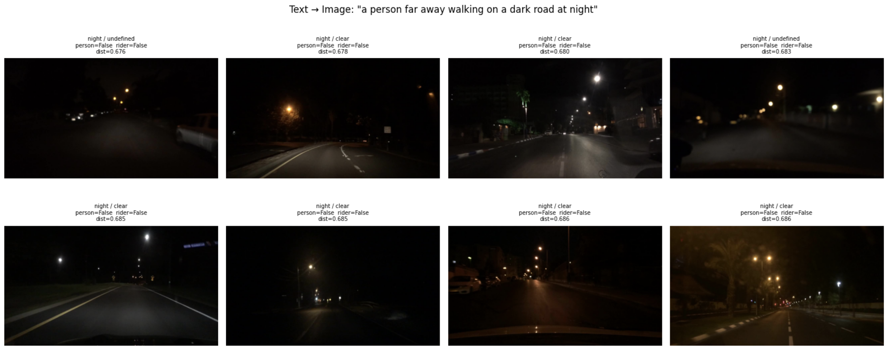
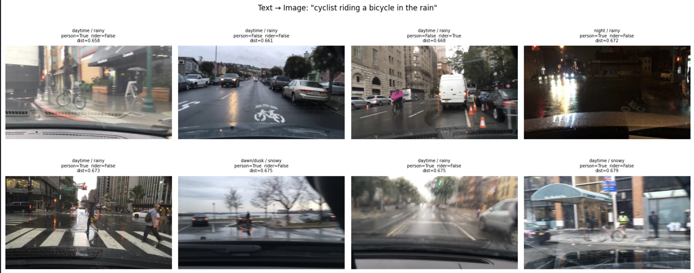
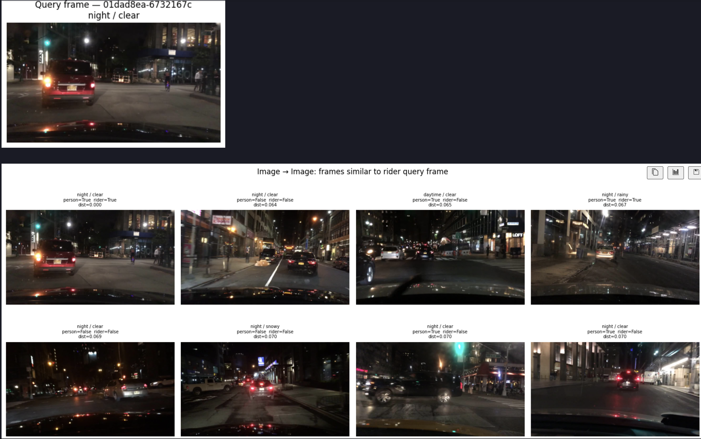
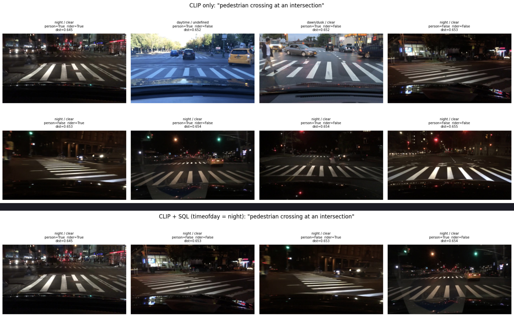
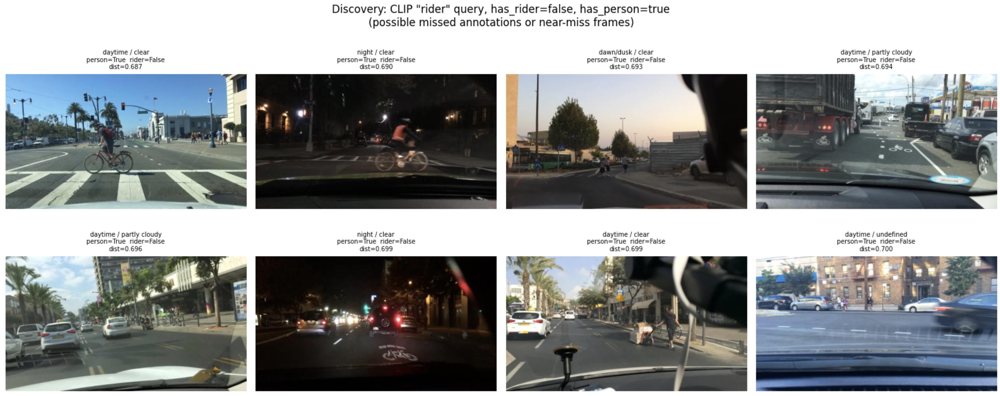
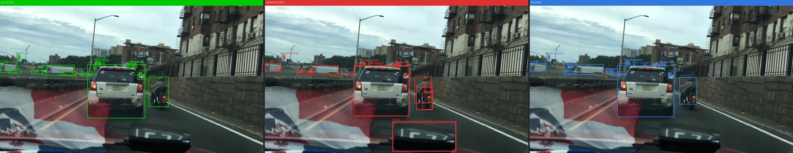
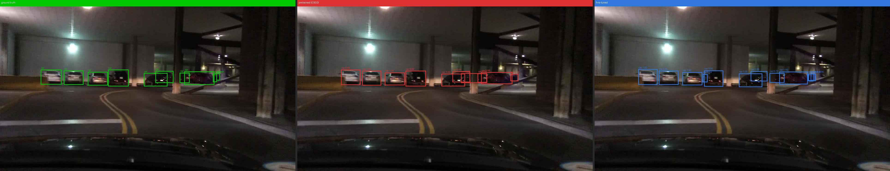
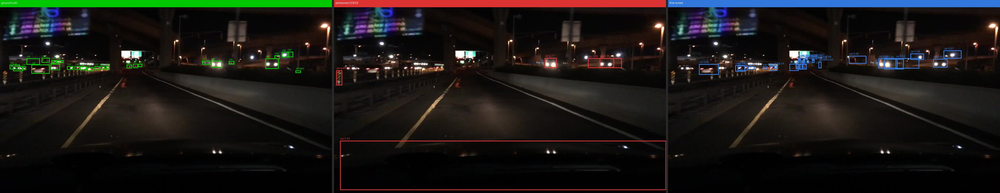

# Accelerated AV Perception training with LanceDB

Targeted fine-tuning on curated failure-mode slices — using LanceDB as the data backbone at every stage of the ML pipeline, from raw video frames to trained checkpoints.

---

## The Problem

A model trained on a standard dataset may fail to generalize to real-world conditions. Here are some examples of failure modes:

| Failure mode | Root cause | Curation signal |
|---|---|---|
| **Riders** | COCO separates `person` and `bicycle`; BDD combines them — the model never saw that silhouette | `has_rider = true` (annotation flag) |
| **Nighttime pedestrians** | COCO training data is heavily daytime-biased | `timeofday = 'night' AND has_person = true` |
| **Distant pedestrians** | Small far-away people are underrepresented; a miss at distance has the highest real-world consequence | `person_bbox_area_pct < 30%` (annotation-derived here; model inference in production) |

The fix is targeted fine-tuning on curated slices. The harder question is *maintenance*: as fleet footage arrives continuously, how do you keep training splits current without manual work — and how do you ensure you're not wasting compute on near-duplicate frames? And ensure that time to train a new model is in hours not days.

---

## Workflow Overview

```
┌─ Fleet footage (BDD100K, ~100k dashcam frames)
│
│                          │ ingest_bdd.py
│                          ▼
│  ┌───────────────────────────────────────────────────────────┐
│  │                    bdd100k  [Lance table]                 │
│  │  image_bytes · weather · scene · timeofday · timestamp    │
│  │  ann_categories · ann_bboxes · ann_occluded · split       │
│  │  ┌──────────────────────────────────────────────────────┐ │
│  │  │  Blob storage     — fast reads, no object-store hop  │ │
│  │  │  Multimodal       — bytes + structs + vectors        │ │
│  │  │  Stable row IDs   — incremental view refresh         │ │
│  │  └──────────────────────────────────────────────────────┘ │
│  └───────────────────────────────────────────────────────────┘
│                          │
│                          │ backfill_geneva.py  (Geneva UDFs — incremental, checkpointed)
│                          │
│                          │  Tier 1 — CPU:  has_person · has_rider · scene_description
│                          │  Tier 2 — GPU:  person_bbox_area_pct  (Faster R-CNN)
│                          │               clip_embedding [512-d]  (CLIP ViT-B/32, cosine IVF-PQ)
│                          │  Tier 3 — GPU:  dhash [64-bit]  (dHash) + IVF L2 → is_duplicate
│                          │
│                          │  ┌──────────────────────────────────────────────────────┐
│                          │  │  Zero-copy evolution  — new column, no table rewrite │
│                          │  │  Incremental backfill — only calculate for new rows  │
│                          │  │  Checkpointed         — crash-safe, restart mid-run  │
│                          │  │  Ray-distributed      — scales to thousands of nodes │
│                          │  └──────────────────────────────────────────────────────┘
│                          │
│                          │  EDA & curate  (eda_bdd100k.ipynb / spec_queries.py)
│                          │  ┌──────────────────────────────────────────────────────┐
│                          │  │  SQL         — columnar index, no JOIN, no export    │
│                          │  │  FTS         — BM25 on scene_description             │
│                          │  │  CLIP vector — text→image · image→image · discovery  │
│                          │  │  SQL-filtered vector search — CLIP + metadata filter │
│                          │  └──────────────────────────────────────────────────────┘
│                          │
│                          │ manage_views.py  (Materialized views)
│                          │  ┌─ Views ──────────────────────────────────────────────┐
│                          │  │  Living SQL queries — curation filter in one place   │
│                          │  │  Versioned refresh  — table.version links weights→data│
│                          │  └──────────────────────────────────────────────────────┘
│                          │
│              ┌───────────┼──────────────┐
│              ▼           ▼              ▼
│    bdd100k_rider  bdd100k_nighttime  bdd100k_distant
│    _{train,val}   _person_{t,v}      _person_{t,v}
│    [Materialized  [Materialized      [Materialized
│       view]          view]              view]
│              └───────────┼──────────────┘
│                          │
│                          │ train_detector.py
│                          │  ┌─ Training ──────────────────────────────────────────┐
│                          │  │  Permutation API — random-access over Lance, no copy │
│                          │  │  PyTorch DataLoaders — direct from Lance tables      │
│                          │  │  High GPU utilization (MFU) — reads direct from Lance│
│                          │  └──────────────────────────────────────────────────────┘
│                          ▼
│               ┌──────────────────┐
│               │    Checkpoint    │  ← version = exact data snapshot
│               │ + table.version  │
│               └──────────┬───────┘
│                          │ new footage arrives
│               ┌──────────▼────────────────────────────────────┐
│               │  append → backfill (new rows only)             │
│               │  → refresh views → train again                 │
└───────────────┴───────────────────────────────────────────────┘
```

---

## Setup

```bash
cd object-detection/
uv venv .venv --python 3.11 && source .venv/bin/activate
uv pip install lancedb geneva torch torchvision pyarrow pillow tqdm open-clip-torch
```

---

## Running the Pipeline

### 1 · Ingest

Raw JPEG bytes, structured metadata (weather, scene, time of day), and parallel-list annotations (one element per bounding box) land in a single Lance table with an enforced schema — no separate preprocessing step. `stable_row_ids` ensures materialized views can be refreshed incrementally after footage is appended.

```bash
python -m object_detection.ingest_bdd --splits train val --overwrite
```

### 2 · Backfill feature columns

Instead of writing frames to disk and running a separate preprocessing job, Geneva UDFs run directly against the Lance table and write results back as queryable columns. Backfill is incremental (`WHERE col IS NULL`), stateful (class-based UDFs with lazy model loading), and checkpointed — safe to re-run as new footage arrives.

```bash
# Tier 1 — CPU, annotation-derived (minutes on full dataset)
python -m object_detection.backfill_geneva --columns has_person has_rider

# Tier 2 — GPU Faster R-CNN: largest detected person bbox as % of frame area
# <30% → pedestrian is distant or small; used to curate the hard-cases split
python -m object_detection.backfill_geneva --gpu --columns person_bbox_area_pct

# Tier 2 — GPU CLIP ViT-B/32: 512-d image embeddings for EDA vector search
# Requires: pip install open-clip-torch
python -m object_detection.backfill_geneva --gpu --columns clip_embedding

```

> **BDD100K vs production:** BDD100K ships with ground-truth bounding boxes, so `person_bbox_area_pct` could be computed directly from `ann_bboxes` without any model inference. The GPU UDF exists to model the **production scenario** — raw, unlabeled fleet footage where ground truth doesn't exist and a detector is the only way to measure pedestrian prominence. The pattern (UDF → backfill → SQL filter) is identical either way; only the UDF implementation changes.

### 3 · Explore

With all signals stored as flat scalar columns, standard SQL and full-text search work directly on the table — no export, no joining with external manifests. The EDA notebook (`notebooks/eda_bdd100k.ipynb`) covers all four retrieval modes.

```bash
python -m object_detection.spec_queries
jupyter lab notebooks/eda_bdd100k.ipynb
```

```python
# SQL — metadata filters
tbl.count_rows(filter="timeofday = 'night' AND has_person = true")          # 6,431 frames
tbl.count_rows(filter="has_rider = true")                                   # 4,105 frames
tbl.count_rows(filter="has_person = true AND person_bbox_area_pct < 30.0")  # ~3,200 frames

# FTS on the Geneva-generated scene_description column
tbl.search("rainy night city pedestrian", query_type="fts").limit(10).to_pandas()

# CLIP text→image — find frames matching a natural-language description
vec = encode_text("a person far away walking on a dark road at night")
tbl.search(vec, vector_column_name="clip_embedding").metric("cosine").limit(8).to_pandas()

# SQL-filtered vector search — scope CLIP results to a metadata constraint
tbl.search(vec, vector_column_name="clip_embedding") \
   .where("timeofday = 'night'", prefilter=True) \
   .limit(8).to_pandas()
```

**Text → Image:** `"a person far away walking on a dark road at night"`



**Text → Image:** `"cyclist riding a bicycle in the rain"`



**Image → Image:** query frame (nighttime city) → similar frames across the full table



**SQL-filtered vector search:** `"pedestrian crossing at an intersection"` — vector only (top) vs vector + `timeofday = 'night'` (bottom)



**Discovery:** CLIP `"person riding a bicycle or motorcycle"`, filtered to `has_rider = false` — surfaces missed annotations and near-miss frames SQL can't find



### 4 · Create training views

A training split is a named SQL materialized view, not a CSV manifest or a directory of files. The filter definition lives in `manage_views.py`; the training script opens the view by name and never needs a WHERE clause. The training script logs `table.version` with every checkpoint — a direct link between weights and the exact data snapshot that produced them.

```bash
python -m object_detection.manage_views --action curate          # Tier 1 views
python -m object_detection.manage_views --action curate-person  # Tier 2 distant-pedestrian views
```

### 5 · Train

LanceDB's Permutation API provides random-access indexing over Lance tables. Workers open their own connections lazily and read directly from the materialized view — no copy to local storage, no intermediate file format. Combined with `pin_memory`, `persistent_workers`, and AMP, this keeps A100 utilisation above 85% on 1280×720 driving footage.

```bash
python -m object_detection.train_detector \
    --train-table bdd100k_rider_train --val-table bdd100k_rider_val \
    --epochs 10 --batch-size 64 --lr 0.04 --num-workers 14 --output-dir checkpoints/rider

python -m object_detection.train_detector \
    --train-table bdd100k_nighttime_person_train --val-table bdd100k_nighttime_person_val \
    --epochs 10 --batch-size 64 --lr 0.04 --num-workers 14 --output-dir checkpoints/nighttime_person

python -m object_detection.train_detector \
    --train-table bdd100k_distant_person_train --val-table bdd100k_distant_person_val \
    --epochs 10 --batch-size 64 --lr 0.04 --num-workers 14 --output-dir checkpoints/distant_person
```

### 6 · Deduplicate

BDD100K is dashcam footage at ~10 Hz. Consecutive frames within a clip are nearly identical pixels — training on them wastes compute and over-represents specific road segments. Dedup is applied as a preprocessing step before training and follows the same two-tier Geneva backfill pattern as every other feature:

**GPU UDF — `dhash`:** Each frame is decoded on GPU via nvjpeg, converted to grayscale, resized to 9×8 as a tensor op, and compared pixel-by-pixel to its right neighbour — producing a 64-bit perceptual hash stored as `list<float32>[64]` with values in {0.0, 1.0}. For binary vectors, L2² = Hamming distance, so a standard LanceDB L2 index doubles as a Hamming index with no extra conversion.

**CPU UDF — `is_duplicate`:** For each row, the nearest non-self neighbour is found via vector search on the `dhash` column. `


```bash
# Backfill dHash as a column on bdd100k (GPU — nvjpeg decode + tensor ops)
python -m object_detection.backfill_geneva --gpu --columns dhash

# Build IVF L2 index on dhash (L2² = Hamming distance for binary vectors)
python -m object_detection.dedup --action index

# Backfill is_duplicate: True when nearest-neighbour Hamming distance <= 10
python -m object_detection.backfill_geneva --columns is_duplicate

# Optional — verify pipeline with synthetic duplicates (inject known copies, check all caught)
python -m object_detection.dedup --action inject --n 1000
python -m object_detection.dedup --action index
python -m object_detection.backfill_geneva --columns is_duplicate --overwrite
python -m object_detection.dedup --action verify
python -m object_detection.dedup --action clean

# Show duplicate rate per training split
python -m object_detection.dedup --action stats

# Recreate views — is_duplicate filter is added automatically
python -m object_detection.manage_views --action curate
python -m object_detection.manage_views --action curate-person
```

### 7 · Refresh after new footage

When new footage is appended, one call per step increments every view's version and makes the extra data immediately available to the training script — no view definitions change, no manifests to regenerate.

```bash
python -m object_detection.ingest_bdd --synthetic 500
python -m object_detection.backfill_geneva --columns has_person has_rider
python -m object_detection.backfill_geneva --gpu --columns person_bbox_area_pct
python -m object_detection.manage_views --action refresh
```

Only new data will be incrementally backfilled:
```
[bdd100k - has_rider (3 fragments)] Rows ready for commit: 100%| 500/500 [00:01<00:00, 336.72it/s]
[bdd100k - has_rider (3 fragments)] Rows committed (every 64 fragments): 100%| 500/500 [00:01<00:00, 336.71it/s]
  [done]     has_rider  (job_id=cb793ece-3721-47e6-8b3d-b891de4b1eb1)

All backfills complete.
```
And refresh keeps materialized views up to date:
```
[bdd100k_rider_val]  515 → 630 rows  (+115)  version 7
```


---

## Results

GPU runs on full BDD100K (80k frames), 10 epochs, A100, batch size 64, AMP enabled. Baseline is the pretrained COCO checkpoint evaluated on each curated val split.

| Failure mode | Metric | Baseline (COCO) | Fine-tuned | Δ |
|---|---|---|---|---|
| **Nighttime pedestrian** | mAP@0.5 | 0.4025 | **0.5260** | **+0.1235** |
| | Precision | 0.4739 | **0.5569** | **+0.0830** |
| | Recall | 0.5923 | **0.7579** | **+0.1656** |
| **Rider** | mAP@0.5 | 0.5563 | **0.6565** | **+0.1002** |
| | Precision | 0.5872 | **0.6016** | **+0.0145** |
| | Recall | 0.6788 | **0.7834** | **+0.1046** |
| **Distant pedestrian** | mAP@0.5 | 0.4746 | **0.5810** | **+0.1064** |
| | Precision | 0.5847 | **0.6363** | **+0.0517** |
| | Recall | 0.6794 | **0.8038** | **+0.1244** |

Recall improvement dominates across all three failure modes — the model catches significantly more of the objects it was previously missing. Nighttime pedestrian shows the strongest lift (consistent with it being the largest distribution shift from COCO's daytime-heavy data). All improvements use the same COCO pretrained weights as starting point; no external data was added.

### Visual examples

Each image shows three panels: **green** = ground truth · **red** = pretrained COCO baseline · **blue** = fine-tuned model

**Rider**



**Nighttime pedestrian**



**Distant pedestrian**



---

## Results — After Deduplication

Dedup (dHash, Hamming ≤ 10) is applied as a preprocessing step before training. Val splits are unchanged. Near-duplicates are filtered from training splits only via the `is_duplicate = false` clause already baked into every materialized view.

**Training data reduction per split**

| Split | Before dedup | After dedup | Removed |
|---|---|---|---|
| rider_train | 3,590 | 3,148 | 442 (12.3%) |
| nighttime_person_train | 5,594 | 3,073 | 2,521 (45.1%) |
| distant_person_train | 22,092 | 19,062 | 3,030 (13.7%) |

Nighttime is hit hardest — long monotonous highway clips at 10 Hz accumulate near-identical frames quickly. Rider and distant pedestrian splits are more episodic, so less redundancy. All training results above are from models trained on these deduplicated splits.

---

## Project Structure

```
object-detection/
├── object_detection/
│   ├── schema.py            # Lance schema + GENEVA_UDF_COLUMNS
│   ├── ingest_bdd.py        # BDD100K → LanceDB (streaming RecordBatch ingestion)
│   ├── geneva_udfs.py       # Tier 1/2/3 UDFs: annotation, Faster R-CNN, CLIP, dHash
│   ├── backfill_geneva.py   # Geneva backfill runner (incremental, checkpointed)
│   ├── manage_views.py      # Create / refresh / status materialized views
│   ├── dedup.py             # Vector index build + duplicate rate stats
│   ├── dataloader.py        # Permutation API + PyTorch DataLoader
│   ├── train_detector.py    # Faster R-CNN fine-tune with AMP (logs table version)
│   ├── eval.py              # mAP@0.5 evaluation
│   └── spec_queries.py      # SQL filter specs + EDA helpers
├── notebooks/
│   └── eda_bdd100k.ipynb    # EDA: distributions, FTS, CLIP text→image, SQL-filtered vector, discovery
└── data/bdd100k/lancedb/    # Lance tables (gitignored)
    ├── bdd100k.lance                          # source table (+ dhash, is_duplicate cols)
    ├── bdd100k_rider_{train,val}.lance
    ├── bdd100k_nighttime_person_{train,val}.lance
    ├── bdd100k_nighttime_rider_{train,val}.lance
    └── bdd100k_distant_person_{train,val}.lance
```
